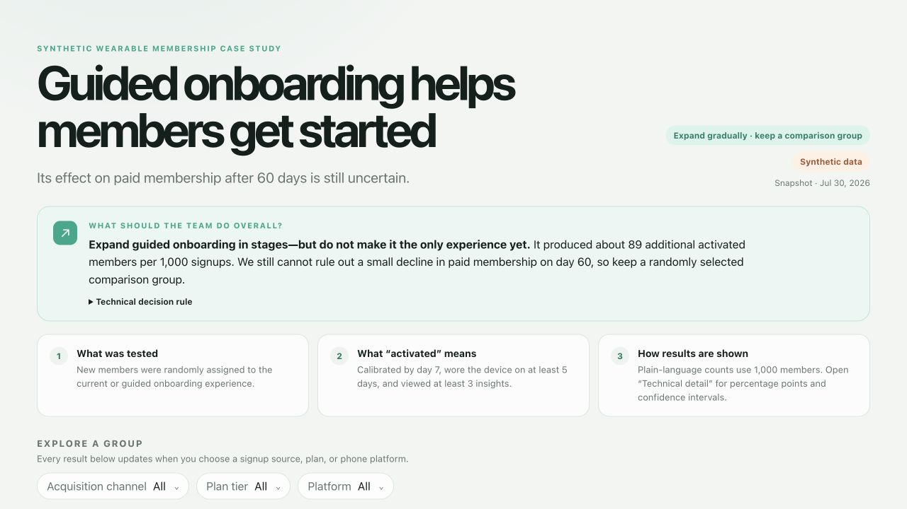

# PulsePath Member Activation & Retention

A decision-first business and product analytics portfolio case study for a fictional wearable-membership company.

> **Important disclosure:** PulsePath is fictional. All records are deterministic and synthetic. This project contains no real member data, biometric data, health information, or financial data from any company. The results demonstrate an analytical approach—not the performance of any real company.

## The one-minute version

| Question | Plain-language answer |
|---|---|
| What business decision are we supporting? | Whether guided onboarding should become the default experience for new wearable members. |
| What happened? | Guided onboarding produced about **89 more activated members per 1,000 signups**. |
| Did paid membership improve after 60 days? | The estimate was positive, but still uncertain: the plausible result ranges from **15 fewer to 34 more paid members per 1,000**. |
| What should the team do? | **Expand guided onboarding in stages and keep a randomly selected comparison group.** Do not claim a proven retention improvement yet. |

This is deliberately not a “green metric means launch” project. The early outcome improved clearly, but the long-term subscription evidence has not cleared the agreed risk threshold.

## Work-sample gallery

[](docs/work-samples/README.md)

The repository includes visual and analytical work samples for different reviewers:

| Sample | What it demonstrates |
|---|---|
| [Executive decision view](docs/work-samples/01-executive-overview.jpg) | Decision-first communication, recommendation boundaries, and plain-language framing |
| [Decision evidence](docs/work-samples/02-decision-evidence.jpg) | KPI hierarchy, uncertainty translated per 1,000 members, and progressive disclosure |
| [Technical source inspection](docs/work-samples/03-technical-source.jpg) | Traceable metric definitions, reviewed data, dataset metadata, and SQL access |
| [Executed notebook](notebooks/member_activation_retention.ipynb) | Reproducible statistical analysis and interpretation |
| [Business requirements](docs/requirements.md) | INVEST user stories, MoSCoW priorities, acceptance criteria, and risks |
| [Independent validation](validation/validation_report.md) | Data-quality controls, reconciliation, limitations, and decision readiness |

See the complete [work-sample guide](docs/work-samples/README.md) for the audience, business purpose, and BA competency demonstrated by each artifact.

## What are we trying to prove?

The project tests three distinct claims:

1. **Early member value:** Does guided onboarding cause more new members to activate during their first seven days?
2. **Durable membership value:** Does it preserve or improve paid subscription status on day 60?
3. **Safety:** Does it avoid harming device pairing or increasing early cancellations?

It does **not** attempt to prove medical benefit, physiological improvement, lifetime value, revenue impact, or that one customer segment responds better than another. Those claims require evidence this dataset does not contain.

## Results in plain and technical language

| Outcome | Comparison experience | Guided onboarding | Plain-language difference | Statistical view |
|---|---:|---:|---|---|
| Activated by day 7 | 31.9% | 40.8% | **89 more per 1,000** | +8.9 percentage points; 95% CI +6.5 to +11.3 |
| Paid membership on day 60 | 61.9% | 62.8% | **9 more per 1,000**, but uncertain | +0.9 points; 95% CI −1.5 to +3.4 |
| Active use around day 60 | 49.4% | 52.7% | **34 more per 1,000** | +3.4 points; 95% CI +0.8 to +5.9 |
| Device paired within 24 hours | 92.8% | 92.1% | **8 fewer per 1,000**, not conclusive | −0.8 points; 95% CI −2.1 to +0.6 |
| Cancelled within 14 days | 4.9% | 4.8% | **1 fewer per 1,000**, not conclusive | −0.1 points; 95% CI −1.2 to +1.0 |

### The recommendation

**Continue a staged rollout while preserving a randomized comparison group.**

Activation is decision-useful. Day-60 paid membership is not yet precise enough to support an unconditional rollout because the lower confidence bound is below the pre-agreed **−1 percentage-point non-inferiority margin**. In ordinary language, we have not yet ruled out a decline larger than 10 retained subscriptions per 1,000 members.

## How the analysis supports a real decision

```text
Ambiguous request
      ↓
Define the stakeholder decision
      ↓
Create KPI, denominator, guardrail, and risk contracts
      ↓
Model experiment assignment and member-day behavior
      ↓
Reconcile SQL, notebook, dashboard, and independent validation
      ↓
Recommend staged action within the evidence boundary
```

The dashboard is the communication layer—not the project’s starting point. Requirements, metric definitions, source models, tests, and decision rules were established before interpreting the result.

## Choose your path through the repository

### For a recruiter, executive, or non-technical reviewer

1. Read this page.
2. Run the interactive dashboard in `dashboard/`.
3. Review the independent [validation report](validation/validation_report.md).
4. Read the [interview guide](docs/interview_guide.md) for a short project narrative.

### For a business analyst

1. Start with the [business-analyst walkthrough](docs/business_analyst_walkthrough.md).
2. Inspect the [requirements and MoSCoW priorities](docs/requirements.md).
3. Review the [metric dictionary](docs/metric_dictionary.md).
4. Examine the [decision log](docs/decision_log.md) and [methodology](docs/methodology.md).

### For a data analyst, analytics engineer, or technical reviewer

1. Open the executed [analysis notebook](notebooks/member_activation_retention.ipynb).
2. Review the warehouse-style models in `sql/`.
3. Inspect the deterministic pipeline in `src/`.
4. Run `tests/test_data_quality.py` and `src/validate_project.py`.

## Why this is a business-analysis project

This repository demonstrates more than SQL and dashboard construction:

- Converts “analyze onboarding” into a specific rollout decision.
- Defines the population, numerator, denominator, observation window, guardrails, and claim boundary.
- Uses intention-to-treat so members who disengage are not silently removed.
- Separates activation, paid retention, engaged retention, and operational safety.
- Applies MoSCoW prioritization and testable acceptance criteria.
- Challenges a conveniently large first simulation effect before using it.
- Treats segment differences as exploratory rather than causal targeting evidence.
- Flags synthetic-data limits, privacy risks, implementation bottlenecks, and hidden assumptions.
- Communicates the same evidence in plain language and statistical language.

## Deliverables

| Artifact | Business purpose |
|---|---|
| `dashboard/` | Mixed-audience decision dashboard with plain-language results, filters, technical definitions, reviewed rows, and source SQL |
| `docs/business_analyst_walkthrough.md` | End-to-end explanation of the BA reasoning and artifacts |
| `docs/requirements.md` | INVEST-oriented user stories with MoSCoW prioritization and acceptance criteria |
| `docs/metric_dictionary.md` | KPI calculations, denominators, windows, owners, decision uses, and guardrails |
| `docs/methodology.md` | Experiment design, assumptions, privacy posture, and analytical limitations |
| `docs/decision_log.md` | Important analytical choices and alternatives that were rejected |
| `notebooks/member_activation_retention.ipynb` | Executed analysis, statistical checks, and reproducible evidence |
| `sql/` | Staging, activation, retention, experiment-result, and cohort models |
| `tests/test_data_quality.py` | Automated integrity, grain, assignment, range, and reconciliation checks |
| `validation/validation_report.md` | Independent calculation and decision-readiness review |

## Data model

```text
Synthetic members ─┐
                   ├─> staging ─> member activation ─> member outcomes
Synthetic activity ┘                                  │
                                                      ├─> experiment results
                                                      ├─> weekly cohorts
                                                      ├─> validation report
                                                      ├─> executed notebook
                                                      └─> dashboard snapshot
```

The member table has one row per randomly assigned member. The activity table has one row per member per relative day. Every member receives the same observation coverage, preventing retention comparisons from silently changing denominator.

## Run the project locally

Prerequisites: Python 3.10+ and Node.js 20+.

```bash
python3 -m pip install -r requirements.txt
python3 src/generate_synthetic_data.py
python3 src/run_pipeline.py
python3 -m pytest -q
python3 src/validate_project.py
python3 src/build_notebook.py
```

Run the dashboard:

```bash
cd dashboard
npm install
npm run dev -- --host 127.0.0.1
```

Create the production bundle:

```bash
npm run build
```

## Analytical quality controls

- **Population:** all 6,000 randomly assigned members with a complete day-60 window
- **Assignment:** 3,013 comparison and 2,987 guided-onboarding members
- **Primary approach:** intention-to-treat
- **Time basis:** relative member days, avoiding calendar-cohort truncation
- **Uncertainty:** two-sided 95% difference-in-proportions intervals
- **Segmentation:** pre-treatment characteristics only; exploratory and not multiplicity-adjusted
- **Privacy:** no names, emails, locations, biometrics, health measures, or real people
- **Claim boundary:** conclusions apply only to this simulation

Validation currently passes **7 automated tests**, exact metric reconciliation, notebook execution, a production dashboard build, and desktop/mobile interface checks.

## Operational risks and hidden assumptions

- The simulation assumes onboarding exposure is delivered correctly; real instrumentation would need exposure and version checks.
- Billing failures, firmware, notifications, support contacts, accessibility events, and device replacement are not modeled.
- “Subscription active” is a simplified state and does not model payment recovery or paused memberships.
- Segment cuts can generate false positives and are not evidence for targeted rollout.
- A real launch requires privacy review, experiment governance, support readiness, and operational ownership.
- No financial recommendation should be made without acquisition volume, unit economics, and implementation cost.

## 60-second interview explanation

> I framed an onboarding request as a rollout decision rather than starting with a dashboard. I defined activation, day-60 paid retention, engaged retention, and safety guardrails with fixed denominators and windows. The simulated randomized experiment showed a clear activation gain—about 89 additional activated members per 1,000—but the paid-retention interval still allowed a decline beyond our agreed tolerance. I therefore recommended a staged rollout with a randomized comparison group. I supported that decision with requirements, SQL, a reproducible notebook, data-quality tests, independent reconciliation, and a dashboard that communicates the same evidence to non-technical and technical audiences.

## Repository structure

```text
pulsepath-member-analytics/
├── dashboard/                 # Interactive decision dashboard
├── docs/                      # Requirements, KPIs, risks, decisions, BA walkthrough
├── notebooks/                 # Executed reproducible analysis
├── sql/                       # Warehouse-style analytical models
├── src/                       # Synthetic generator, pipeline, validation, notebook builder
├── tests/                     # Automated data-quality tests
└── validation/                # Independent validation evidence and report
```

## Final interpretation boundary

This project is portfolio evidence of business analysis, product analytics, data validation, and stakeholder communication. It is not an analysis of any real company, a real-world causal claim, medical guidance, or financial advice.
