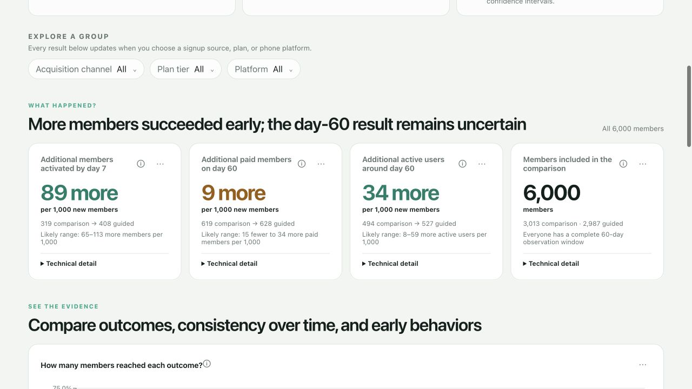
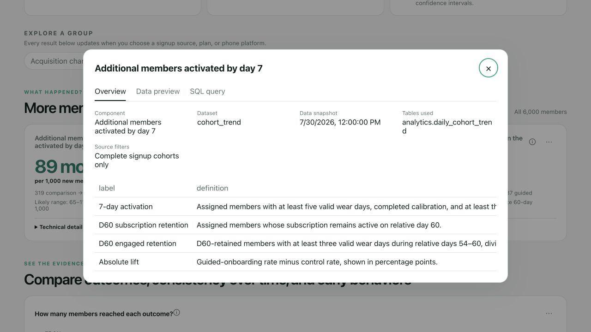

# PulsePath Work Samples

This gallery gives recruiters, executives, business analysts, and technical reviewers a fast way to inspect the project without reading the repository in file order.

All screenshots and results use fictional PulsePath data. No real member, WHOOP, biometric, health, or financial information is included.

## 1. Executive decision communication

### Business purpose

Answer the stakeholder’s question before presenting detailed analysis:

> Should guided onboarding become the only experience for new members?

The screen states the action, the evidence supporting it, and the unresolved downside risk. It translates the activation effect into **89 additional activated members per 1,000 signups** while making clear that day-60 paid membership remains uncertain.

### Business-analysis capabilities demonstrated

- Decision framing rather than dashboard-first delivery
- Clear recommendation with an evidence boundary
- Translation of statistical output into stakeholder language
- Visible synthetic-data and claim-limit disclosures
- Layered communication for mixed audiences

## 2. KPI and decision evidence

### Business purpose

Show the outcomes required for the rollout decision in one scan:

- primary early-value outcome;
- paid-membership outcome;
- active-use outcome;
- complete experimental population.

The retention card deliberately shows **9 more paid members per 1,000** alongside the uncertainty range of **15 fewer to 34 more**. This prevents a positive point estimate from being mistaken for conclusive evidence.

### Business-analysis capabilities demonstrated

- KPI hierarchy tied to a specific decision
- Fixed populations and observation windows
- Plain-language uncertainty communication
- Technical detail available without overwhelming the default view
- Global segmentation filters that do not replace the overall decision

## 3. Technical source and definition inspection

### Business purpose

Allow data analysts, analytics engineers, and governance reviewers to audit what a dashboard component means and where it came from.

The source experience exposes:

- dataset and snapshot metadata;
- source filters and table identity;
- metric definitions;
- reviewed data rows;
- source SQL.

### Business-analysis capabilities demonstrated

- Requirements-to-metric traceability
- Definition management
- Source transparency
- Shared evidence for technical and non-technical stakeholders
- Reduced risk of multiple teams using conflicting KPI definitions

## 4. Functional requirements

Open: [requirements.md](../requirements.md)

The requirements convert the business problem into INVEST-oriented user stories with:

- MoSCoW priority;
- testable acceptance criteria;
- operational, analytical, and privacy risks;
- explicit exclusions.

This sample demonstrates that the analytical deliverables were defined as stakeholder capabilities rather than a list of charts.

## 5. KPI and measurement contract

Open: [metric_dictionary.md](../metric_dictionary.md)

The metric dictionary specifies:

- business definition;
- numerator and denominator;
- time window;
- experiment population;
- decision use;
- guardrail relationship.

This is the contract connecting stakeholder language to SQL, validation, and dashboard behavior.

## 6. Executed analytical notebook

Open: [member_activation_retention.ipynb](../../notebooks/member_activation_retention.ipynb)

The notebook provides a reproducible audit trail for:

- experimental allocation;
- KPI calculation;
- confidence intervals;
- weekly stability;
- segment exploration;
- interpretation and recommendation.

The notebook is executed and stored with outputs so reviewers can inspect the evidence directly on GitHub.

## 7. SQL transformation samples

Open:

- [Member staging](../../sql/01_stg_members.sql)
- [Activation model](../../sql/02_member_activation.sql)
- [Retention model](../../sql/03_member_retention.sql)
- [Experiment results](../../sql/04_experiment_results.sql)

These samples show how business definitions are implemented at a stable member grain. They protect against denominator drift and separate reusable outcome modeling from final experiment comparison.

## 8. Independent validation

Open: [validation_report.md](../../validation/validation_report.md)

The validation sample checks grain, completeness, reconciliation, assignment balance, uncertainty calculations, and decision readiness independently of the main notebook presentation.

It also documents why the project is ready to share **with caveats**, rather than labeling every passing test as proof that the business recommendation is correct.

## 9. Decision and methodology documentation

Open:

- [Decision log](../decision_log.md)
- [Methodology](../methodology.md)
- [Business Analyst walkthrough](../business_analyst_walkthrough.md)
- [Interview guide](../interview_guide.md)

Together, these samples show the decisions made, assumptions rejected, limitations retained, and stakeholder narrative used to communicate the outcome.

## Reviewer map

| Reviewer | Recommended samples |
|---|---|
| Executive or recruiter | Samples 1, 2, and 8 |
| Business analyst | Samples 1, 4, 5, 8, and 9 |
| Product manager | Samples 1, 2, 4, and 9 |
| Data analyst | Samples 2, 5, 6, 7, and 8 |
| Analytics engineer | Samples 5, 7, and 8 |
| Data or privacy reviewer | Samples 3, 5, 8, and 9 |

## Interpretation boundary

These work samples demonstrate a portfolio workflow: decision framing, requirements, metric design, reproducible analysis, validation, and stakeholder communication. They do not represent a real wearable company’s performance and must not be used for medical, financial, or operational decisions.
